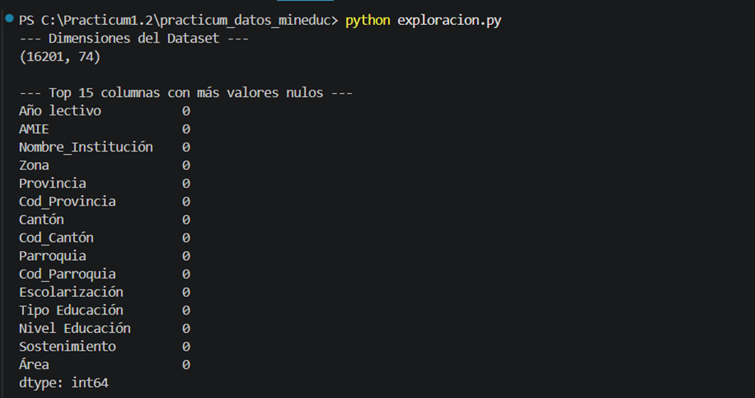
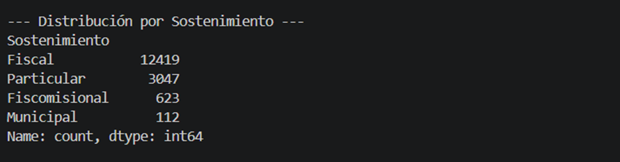
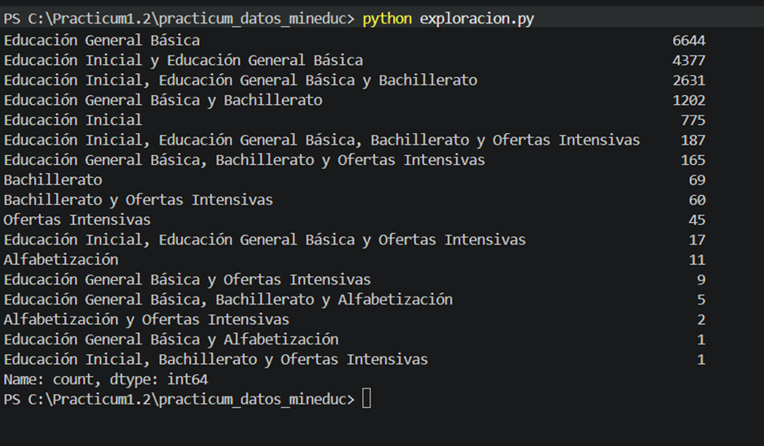
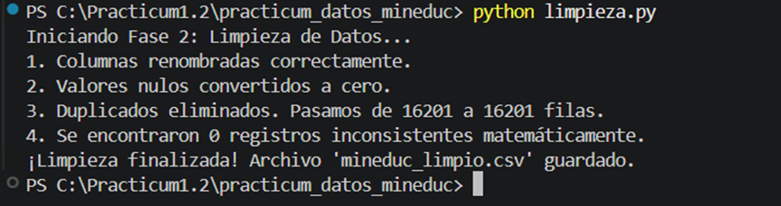
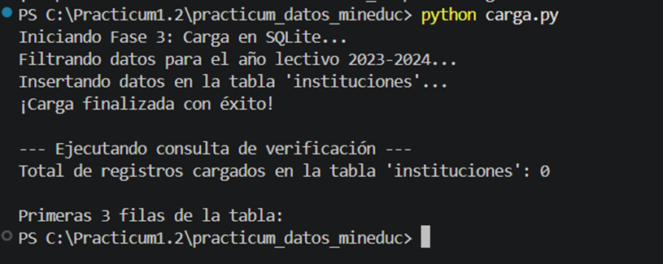
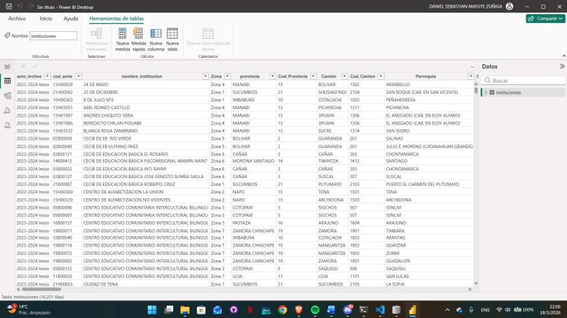
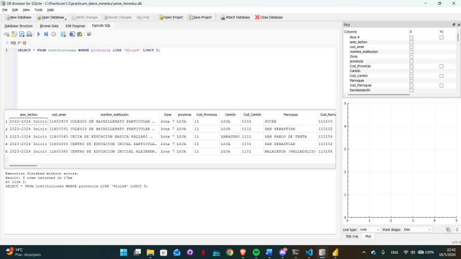
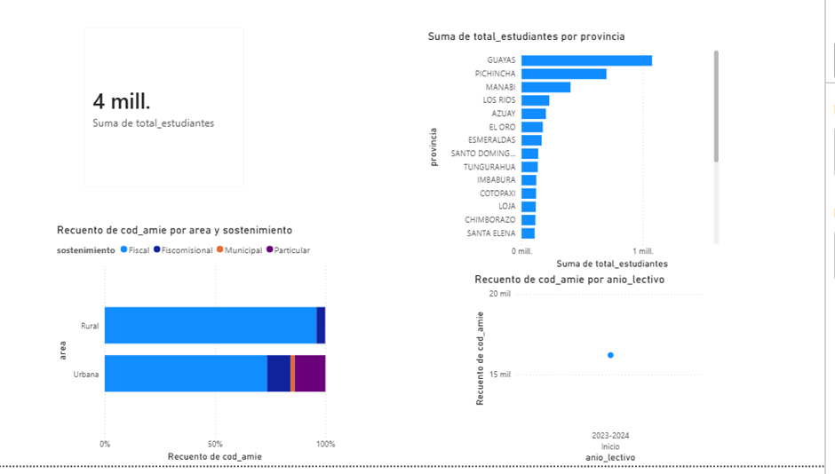

# Pipeline de Datos: Del CSV Crudo al Dashboard 📊

**Universidad Técnica Particular de Loja (UTPL)** **Carrera:** Computación (4to Ciclo)  
**Asignatura:** Prácticum 1.2 - Estado del Arte con énfasis en Ingeniería de Datos  
**Autor:** Daniel Matute  

## Descripción del Proyecto
Este proyecto implementa un pipeline de datos completo (ETL) utilizando el Archivo Maestro de Instituciones Educativas (AMIE) del Ministerio de Educación del Ecuador (MINEDUC). El objetivo es procesar un dataset gubernamental real, superando problemas comunes de calidad de datos, para finalmente construir un dashboard interactivo que responda a preguntas analíticas específicas sobre el panorama educativo del país.

## Stack Tecnológico 🛠️
* **Lenguaje:** Python 3.10+
* **Librerías:** `pandas` (limpieza y manipulación), `sqlalchemy` (conexión a base de datos).
* **Base de Datos:** SQLite (local).
* **Visualización:** Power BI Desktop (conexión vía script de Python).

## Estructura de Fases y Ejecución

### Fase 1: Exploración y Diagnóstico (`exploracion.py`)
Se realizó una inspección inicial del archivo CSV (codificado en `latin-1` con separador `;`) para entender la estructura original sin realizar modificaciones.
* **Dimensiones:** El dataset crudo contiene 16,201 filas (instituciones) y 74 columnas.
* **Hallazgos:** Se identificaron columnas clave con tildes y espacios (ej. `Nivel Educación`, `Nombre_Institución`), lo cual dificulta la manipulación programática. Se observó una predominancia de instituciones de sostenimiento Fiscal (12,419) seguidas por las Particulares (3,047).

### Fase 2: Limpieza de Datos (`limpieza.py`)
Se construyó un script secuencial con pandas aplicando cuatro transformaciones críticas:
1. **Renombrado Estándar:** Se eliminaron tildes, espacios y caracteres especiales de las columnas de interés para asegurar la compatibilidad con motores SQL.
2. **Imputación de Nulos:** Los valores faltantes en métricas clave (`total_docentes`, `total_estudiantes`, desagregaciones por género) se rellenaron con `0` y se convirtieron a tipo entero. El `0` representa ausencia de reporte, no necesariamente ausencia de individuos.
3. **Deduplicación:** Se garantizó la unicidad de los registros utilizando la clave primaria compuesta por `cod_amie` y `anio_lectivo`. 
4. **Validación de Consistencia:** Se implementó una verificación matemática para asegurar que la suma de estudiantes masculinos y femeninos coincida con el total reportado.
* **Salida:** Generación del archivo transaccional `mineduc_limpio.csv`.

### Fase 3: Carga Relacional (`carga.py`)
Utilizando `sqlalchemy`, el dataset limpio se exportó a una base de datos relacional local.
* Se estableció la conexión automatizada a `amie_mineduc.db`.
* Se generó la tabla `instituciones` reemplazando ejecuciones previas para mantener la idempotencia del pipeline.

### Fase 4: Dashboard y Visualización Analítica
Se conectó Power BI directamente a la base de datos SQLite mediante un script de extracción en Python, permitiendo modelar los datos y construir las siguientes visualizaciones:

* **KPI Global:** Un recuento total que muestra ~4 millones de estudiantes matriculados a nivel nacional.
* **P1 - Matrícula por Provincia:** Gráfico de barras horizontales que evidencia la concentración de estudiantes, liderada por las provincias de Guayas y Pichincha.
* **P2 - Proporción Institucional en Loja:** Gráfico de barras apiladas al 100% filtrado a nivel de objeto visual exclusivamente para la provincia de Loja, contrastando el sostenimiento (Fiscal, Fiscomisional, Particular, Municipal) segmentado por zona Urbana y Rural.
* **P3 - Evolución Temporal:** Estructura de línea temporal por `anio_lectivo` vs Recuento de `cod_amie`. 

## Instrucciones de Reproducción
1. Clonar este repositorio y asegurar que el archivo original `MINEDUC_RegistroAdministrativo_2023-2024Inicio.csv` se encuentre en la raíz.
2. Instalar dependencias mediante la terminal: `pip install pandas sqlalchemy matplotlib`
3. Ejecutar los scripts en orden cronológico:
   * `python exploracion.py`
   * `python limpieza.py`
   * `python carga.py`
4. Abrir el archivo `.pbix` en Power BI y actualizar los datos (requiere tener el entorno de Python configurado en las opciones globales de Power BI).